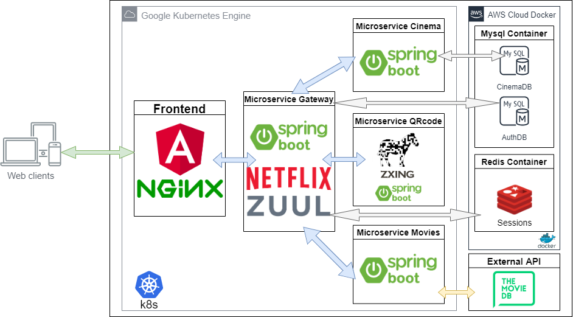

# MOUNACH CINEMA PLATEFORME

- Rapport : https://drive.google.com/open?id=11dn5cZOCZNqrTKpMwwodnXw6RRgw39Pm

- Youtube demo : https://www.youtube.com/watch?v=5X4VUgfR_L0&feature=youtu.be

A.	Backend :

-	Java 8.
-	Spring.
-	Spring Boot.
-	Spring Data.
-	Spring Session.
-	Zuul.
-	Eureka (utilisé dans la version sans kubernetes, car on a pas besoin de Eureka dans kubernetes).
-	REST.
-	Mysql.
-	Redis.

B.	Frontend :

-	Angular 8.
-	Typescript.
-	Angular material design.
-	Flex layout.
-	Bootstrap 4.
-	Leaflet
-	Google Places API.
-	PayPal Sandbox API.

C.	Infrastructure :

-	Docker.
-	Kubernetes (k8s).
-	Nginx.
-	Google kubernetes engine.
-	AWS EC2.
